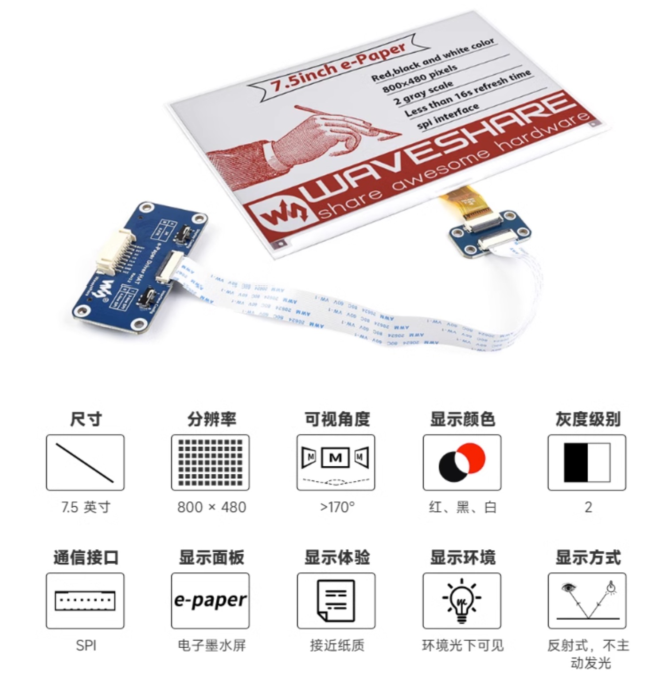

#  Portal Calendar

zh | [en原项目readme](https://github.com/eleveyuan/portal_calendar/blob/master/README-en.md)

这是一个墨水屏电子日历的项目，原项目地址：[Portal Calendar](https://github.com/wuspy/portal_calendar)

看到这个项目想着感觉更加适合我们的黄历，考虑到我妈需要看看黄历，打算就做一个电子黄历

## 材料

下面都是在国内找到下载链接，
- **Waveshare 7.5" 800x480 E-Ink display** Waveshare电子墨水屏，可以在taobao搜索：微雪旗舰店（或点击这个[链接](https://detail.tmall.com/item.htm?id=633262461077 = 100)，个人选择的红黑白版本的显示器，想显示黄历）

- **EzSBC ESP32 breakout board** esp32开发板，随便搜索，比较随意，毕竟esp32比较便宜

- **4xAAA battery holder** 电池盒，淘宝(**AAA电池**是一种美国的干电池标准，**7号电池**标准与其兼容。)

- **9x M3x8 cap head screws** M3x8帽头螺钉，依旧淘宝搜索一大堆

- **framework** 使用3d打印出来，淘宝3d打印，价格略贵（>￥100）😓

## 黄历api

这里采用聚合数据提供的api：https://www.juhe.cn/docs/api/id/65 （每天免费调用50次）
